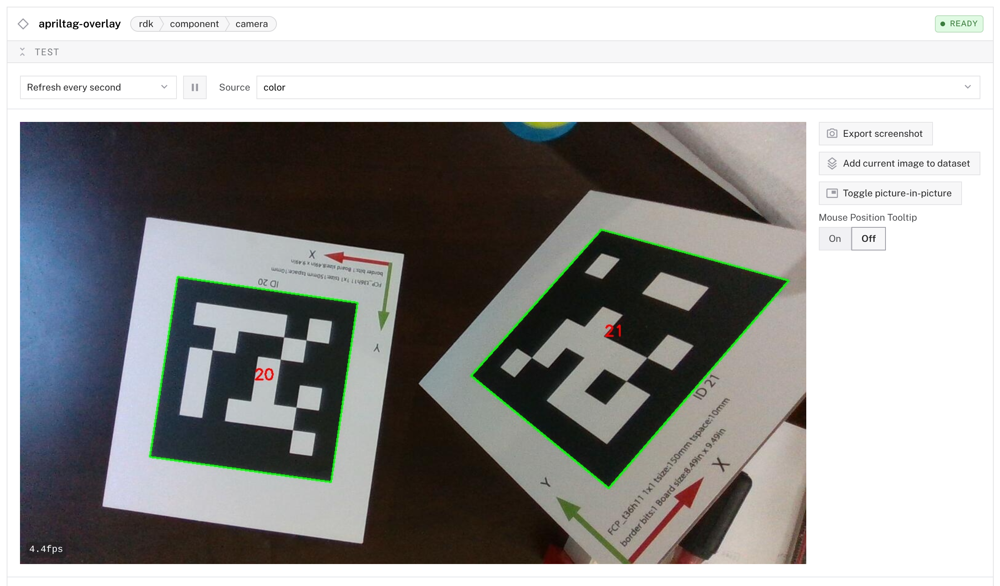

# apriltag-tracker

A Viam module that continuously detects AprilTags in a camera feed and exposes them in two complementary ways:

- **3D scene view** — each detected tag is published as a world state transform, so it renders as a flat box in the Viam app's 3D scene tab, positioned in the camera's reference frame.
- **2D overlay view** — a wrapping camera component returns annotated JPEG frames with each tag's four corners drawn as a polygon and the tag id labelled at the center.

> **Note:** The [`viam-labs/apriltag`](https://github.com/viam-labs/apriltag) module is poll-based — it implements the `PoseTracker` component, and clients call `get_poses` to retrieve current detections. This module is continuous: detection runs in a background loop and pushes events to subscribers, so tags render in the 3D scene without client-side polling.

## Models

| Model | API | Description |
| ----- | --- | ----------- |
| `shrews-testing:apriltag-tracker:april_tag_visualizer` | `rdk:service:world_state_store` | Continuous AprilTag detector that publishes detected tags as world state transforms for the 3D scene tab. |
| `shrews-testing:apriltag-tracker:overlay_camera` | `rdk:component:camera` | Camera that wraps another camera and overlays each detected tag's four corners (true rotated/skewed quad) and id on the frame. |

The two models are independent — install the module once and add either or both to your machine. Both depend on a JPEG-producing source camera.

## 3D scene view — `april_tag_visualizer`

Add the service to your machine's configuration:

```json
{
  "camera_name": "camera-1",
  "tag_family": "tag36h11",
  "tag_width_mm": 29.5,
  "detection_rate_hz": 5.0
}
```

### Attributes

| Name | Type | Inclusion | Default | Description |
| ---- | ---- | --------- | ------- | ----------- |
| `camera_name` | string | **Required** | — | Name of the camera component to read frames from. The service declares this as an implicit dependency. |
| `tag_family` | string | **Required** | — | AprilTag family to detect, e.g. `tag36h11`, `tag25h9`, `tagStandard41h12`. Comma-separated values are accepted to detect multiple families simultaneously. |
| `tag_width_mm` | float | **Required** | — | Physical tag width corner-to-corner in millimeters. Required for metric pose estimation; an incorrect value produces tags at the wrong distance. |
| `detection_rate_hz` | float | Optional | `5.0` | Detection loop rate. Each cycle pulls a frame, runs detection, and emits diff events to subscribers. Higher rates increase camera and CPU load. |
| `centroid_alpha` | float | Optional | `1.0` | Opacity of the centroid box geometry, between `0.0` (fully transparent) and `1.0` (fully opaque). At values below `1.0` the box is published with `metadata: {"opacity": <alpha>}` so the 3D scene viewer can render it translucent and let underlying point clouds / scene content show through. The BL-corner origin marker stays opaque regardless. *Note:* requires a 3D scene viewer that honors `Transform.metadata.opacity`. |

### Camera requirements

- **Intrinsics must be configured.** The detector uses `focal_x_px`, `focal_y_px`, `center_x_px`, `center_y_px` from the camera's `intrinsic_parameters`. With unset or zero-valued intrinsics, pose estimation is meaningless.
- **JPEG output.** The detection loop converts the first JPEG-mime image returned by `get_images()` to grayscale. Cameras that publish only PNG or raw frames will be skipped.
- **The camera must have a frame configured** in the frame system (parent, translation, orientation). Without that, the renderer has no way to place the camera in the world and the tag transforms will be orphaned.

#### Multi-sensor cameras and `extrinsic_parameters`

Some cameras report intrinsics for one sensor (e.g. color) while treating a different sensor as the frame origin (e.g. depth). Viam's RealSense module does this: `get_properties` returns the color stream's intrinsics when `main_sensor` is color, but the camera's reference frame is anchored at the depth left imager. Without compensation, tag poses derived from color-stream intrinsics arrive in the color sensor's frame and end up offset by roughly 15 mm in X relative to where Viam's frame system expects them. This module reads `properties.extrinsic_parameters.translation` — which the RealSense module populates with the color→depth offset in millimeters — and adds it to every emitted tag pose, so the rendered position lands at the correct camera reference origin automatically. For cameras that leave `extrinsic_parameters` unset, the offset is `(0, 0, 0)` and the correction is a no-op.

### How tags appear in the 3D scene

Each detected tag is published as **two** world state transforms per cycle:

- `april_tag_<id>_origin_<epoch_ms>` — a 10 mm marker cube at the tag's bottom-left corner. This is what carries the visible axes triad. Its frame has X right, Y up, and Z pointing into the tag (away from the camera).
- `april_tag_<id>_centroid_<epoch_ms>` — a flat `tag_width_mm × tag_width_mm × 1 mm` box centered on the tag, covering the printed face.

The visible **labels** in the 3D scene UI are unsuffixed — `april_tag_21_origin` and `april_tag_21_centroid` — so the displayed name doesn't churn even though the underlying UUID does.

Two transforms are needed because the 3D scene viewer ignores the `Geometry.center` field on a `Transform`: the geometry is always drawn at the frame's pose. To show both a corner-anchored axes triad and a tag-area geometry, the two anchors must live on separate frames.

The bottom-left corner is computed from the detector's reported pose by translating along `R · (-w/2, +w/2, 0)`. dt_apriltags uses Y-down tag-local coordinates, so `+y` is physically down. The display orientation rotates the apriltag frame 180° around X, which gives a final convention of X right, Y up, Z into the tag.

### Event semantics

The detection loop runs at `detection_rate_hz`. Each cycle stamps every UUID with a fresh epoch-millisecond suffix and emits, in order:

1. `REMOVED` for every UUID present in the previous cycle.
2. `ADDED` for every UUID present in the new cycle.

`UPDATED` is intentionally never emitted. The 3D scene renderer caches by UUID and ignores `ADDED` for any UUID it has previously seen — even after a `REMOVED` — so geometries would appear frozen if we used stable UUIDs with `UPDATED`. Per-cycle UUID timestamping (the same workaround pallet-config uses) ensures every cycle's emit looks fresh to the renderer and the geometries track motion in real time. The visible labels stay stable so the 3D scene UI remains readable.

There is no movement threshold and no flicker debouncing: every cycle a tag is visible re-emits its two UUIDs at the new timestamp, and a missed frame produces a clean `REMOVED` for that tag's last-seen UUIDs without an immediate `ADDED`.

### Querying via `do_command`

Other modules and SDK clients can query the visualizer directly with `do_command`. The dispatch key is `"command"`:

| `command` | Other input | Returns |
| --------- | ----------- | ------- |
| `list_tags` | — | `{ "tags": [21, 23], "timestamp_ms": ... }` — sorted unique tag ids currently detected. |
| `list_uuids` | — | `{ "uuids": ["april_tag_21_centroid_<ts>", ...], "timestamp_ms": ... }` — every UUID in the current state. |
| `get_pose` | `"tag_id": 21` | `{ "tag_id": 21, "pose": {x, y, z, o_x, o_y, o_z, theta}, "observer_frame": "<camera_name>", "timestamp_ms": ... }` — or `{ "tag_id": 21, "pose": null }` if not currently detected. Pose is the centroid pose, in the camera's reference frame, in millimeters. |
| `get_transforms` | — | `{ "transforms": [{uuid, label, observer_frame, pose, metadata}, ...], "timestamp_ms": ... }` — full snapshot of every current transform. The `metadata` field reflects what the visualizer is sending on the wire (e.g. `{"opacity": 0.4}` on centroid entries when `centroid_alpha` is below 1.0); useful for verifying a renderer-side issue isn't on this module's side. |
| (no `command` key) | — | A debug snapshot — loop liveness, last cycle timing, intrinsics, distortion params, sensor offset, mime types reported by the camera, current tracked UUIDs, configured attributes. Useful for diagnosing why detection isn't working. |

Poses come back in the camera's reference frame (`observer_frame`). To express them in the world frame, callers can compose with the camera's frame using Viam's motion service (`motion.get_pose("<camera_name>", "world")`).

## 2D overlay view — `overlay_camera`

Add a camera component to your machine:

```json
{
  "name": "apriltag-overlay",
  "api": "rdk:component:camera",
  "model": "shrews-testing:apriltag-tracker:overlay_camera",
  "attributes": {
    "camera_name": "camera-1",
    "tag_family": "tag36h11"
  }
}
```

### Attributes

| Name | Type | Inclusion | Description |
| ---- | ---- | --------- | ----------- |
| `camera_name` | string | **Required** | Name of the source camera component to wrap. The overlay camera reads JPEG frames from this camera, runs detection, and re-encodes with corners drawn. |
| `tag_family` | string | **Required** | AprilTag family to detect. Comma-separated values are accepted. |

### How the overlay looks

The overlay camera shows up in the **CONTROL** tab as a regular camera. Each detected tag's four corners are drawn as a green polygon (rotated and skewed to match the tag's actual perspective in the image) and the tag id is labelled in red at the tag center.



The wrapper proxies `get_properties` and `get_point_cloud` to the source camera unchanged, and only annotates JPEG-mime images. Non-JPEG images (e.g. depth) pass through untouched. Detection runs on each `get_image` / `get_images` call rather than from a continuous loop, since cameras are pulled by clients on demand.

## Generating tags

The example `tag36h11` PDF from the predecessor module is suitable for getting started: [`tag36h11_1-30.pdf`](https://github.com/viam-labs/apriltag/blob/main/tag36h11_1-30.pdf). Online generators such as [shiqiliu-67's apriltag-generator](https://shiqiliu-67.github.io/apriltag-generator/) can produce other families and sizes. For details on the AprilTag specification, see the [AprilRobotics repo](https://github.com/aprilrobotics/apriltag).

## Local development

```sh
python3 -m venv .venv
.venv/bin/pip install -r requirements.txt
.venv/bin/python -m src.main
```

The module expects to be launched by `viam-server` via `run.sh`, which provisions a virtualenv and installs dependencies before exec-ing the entrypoint.

## Tests

```sh
make test
```

Installs `requirements-dev.txt` (pytest + pytest-asyncio on top of runtime deps) and runs the suite under `tests/`. The tests construct fake apriltag detections and exercise the per-tag transform math, config validation, and the `do_command` dispatch surface — no live camera required. Tests must be run from the repo root because `spatialmath.py` loads `libviam_rust_utils-linux_<arch>.so` via a relative path.

## Build

```sh
make module.tar.gz
```
